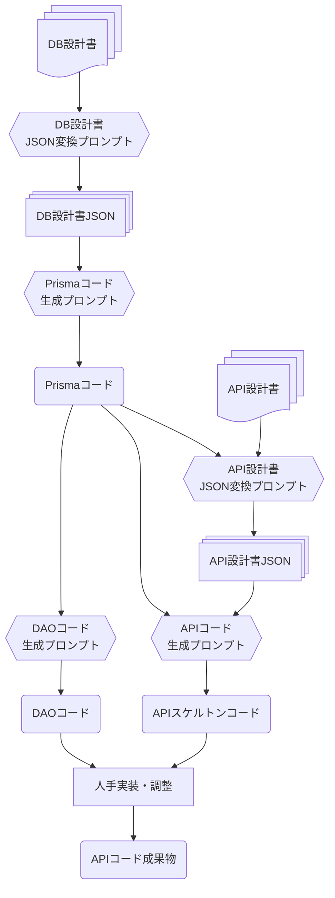

# Simple contract management system API

AIガバナンス実証サンプルAPI

本APIは、[simple-contract-management-system](https://github.com/ryo-ichikawa-0308/simple-contract-management-system)とそのサブモジュール群で提示するドキュメント統制・AIガバナンスの実証サンプルである。

## 設計と実装

- **DB設計**: [Simple contract management system データベース定義標準仕様書](https://github.com/ryo-ichikawa-0308/scms-db-docs)のサンプルDB設計書
- **API設計**: [Simple contract management system API設計標準仕様書](https://github.com/ryo-ichikawa-0308/scms-api-docs)のサンプルAPI設計書

これらの設計書をインプットとし、下記のプロンプト群を用いてスケルトン生成を行った。

- **スケルトン生成**:[scms-prompt: AIガバナンスとコード自動生成のためのプロンプト集](https://github.com/ryo-ichikawa-0308/scms-prompts)のプロンプト群

出力されたスケルトンコードに、ビジネスロジック・テストコードを人手実装することで、本APIの実装とした。

### 設計と実装のプロセス

設計書からAPIコード成果物までのフローを以下に示す。

## AIとプログラマの責任分離

APIの実装にあたり、下記の通りAIとプログラマの責任範囲を定義した。

### AIの責務

AIの責務は、API設計とDB設計に従ってDAOコード・APIスケルトンコードの出力をするところまでとした。

### プログラマの責務

プログラマの責務は、ビジネスロジック・テストコードの実装と、API設計書のエンドポイント仕様(コントローラーメソッドのI/O仕様)を変えない範囲で下記の修正を行うこととした。

- 過剰なコメントの削除
- 空もしくはサロゲートキーのみといった、冗長なDTOの整理
- コントローラー層・サービス層間の呼び出し関係整理
- リスト取得の要素(明細)と1件取得の明細など、クラス名は異なるが、本質的に同じであるオブジェクトの統合
- AIで自動生成したDAOの基本メソッドの、エンドポイント仕様への適合(関連テーブルの追加、不要なメソッドの削除、DTO項目の調整等)
- モジュールクラスの整理
- 認証周りのような共通モジュール・サービスの実装

また、実装中にAIで作成したコードスニペットを取り込む際には、実装済みのコードに適合するように調整を行った。

### テストコードの実装について

著者検証環境(Gemini無料版)での実証においては、「APIコード生成プロンプト」と「API設計書JSON」及び「Prismaコード」をファイルアップロードしたGeminiに、実際に実装したAPIのコードを与えてテストコードを出力させたところ、各コンポーネントのロジック、バリデーション、および依存関係の呼び出しが適切に行われていることを検証できる品質のテストコードが自動生成でき、プログラマの作業は下記の4点に留まった。

- コンパイルエラー、ESLint対応
- 過剰なコメントの削除
- モック及びビジネスロジック呼び出しの確認
- 異常系(例外の型、エラーメッセージ)の確認、必要に応じてパターン追加

テストコードが上記の品質で自動生成できた要因としては下記の理由が考えられる。

- そもそものフレームワーク構成として、各レイヤーの責務を適切に分離した設計となっていた
- 設計書に基づく構造化ファイル(JSON、Prismaコード)を前提とした学習が行われていた
- ビジネスロジック自体も、適切な粒度で責務分割・実装されていた

## 構成要素

| ファイル/ディレクトリ                      | 役割                     | 備考                                                                                                                  |
| ------------------------------------------ | ------------------------ | --------------------------------------------------------------------------------------------------------------------- |
| [api-tutorial.md](./docs/api-tutorial.md)  | API実装マニュアル        | APIのコーディングルール。                                                                                             |
| [scms-backend](./scms-backend)             | API本体                  | APIの実装コード。                                                                                                     |
| [test-command.md](./docs/test-commands.md) |API疎通テストコマンド     | APIの動作確認を行うcurlコマンド集。                                                                                          |
| README.md(本書)                            | ドキュメントの概要と構成 |                                                                                                                       |

(C)2025 Ryo ICHIKAWA
